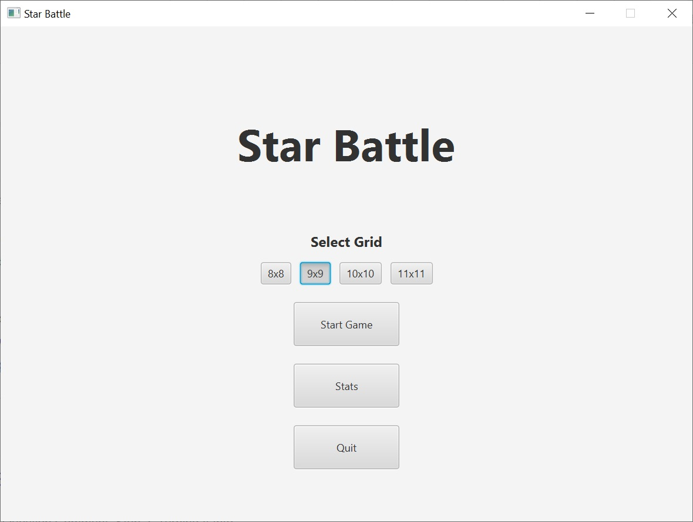
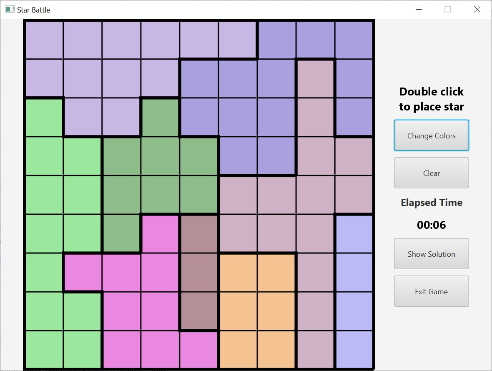
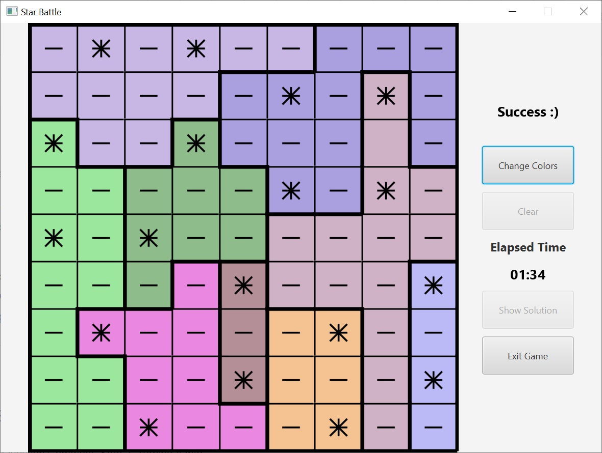
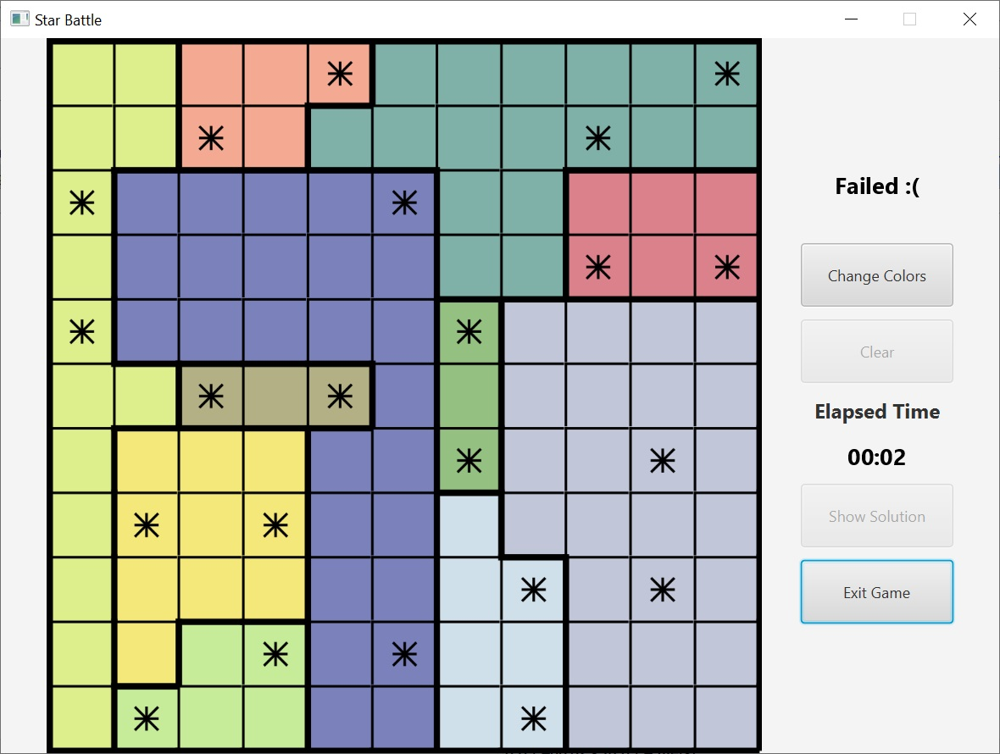
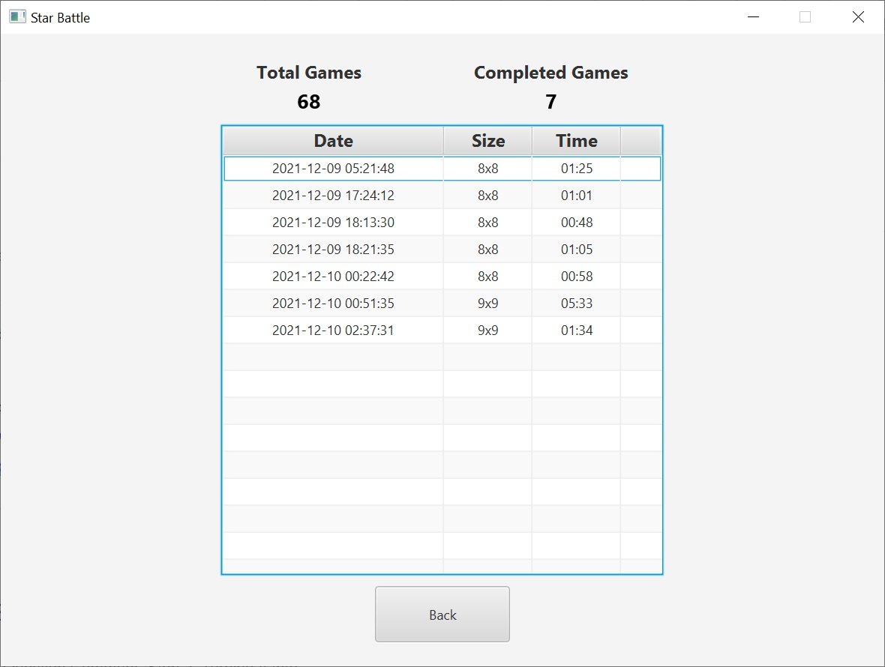

# Star Battle

Star Battle logic puzzle game implemented in Kotlin with TornadoFX UI framework.

## Rules
 - Game is played on an *N* by *N* square grid which is divided to *N* regions.
 - 2 stars must be placed in each row, column and region.
 - Stars cannot be in neighbouring cells (not even diagonally).

## Main Features
 - Grid generation with the specified size with unambiguous solution.
 - Measuring and storing the player's time.
 - The solution is shown if the player gives up the game

## Screens from the application

### Main Screen

### New Game Screen

### Successful Game Screen

### Failed Game Screen

### Statistics Screen

